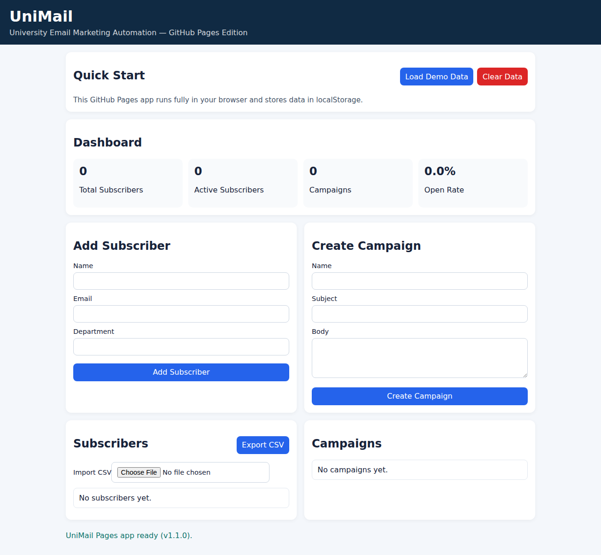
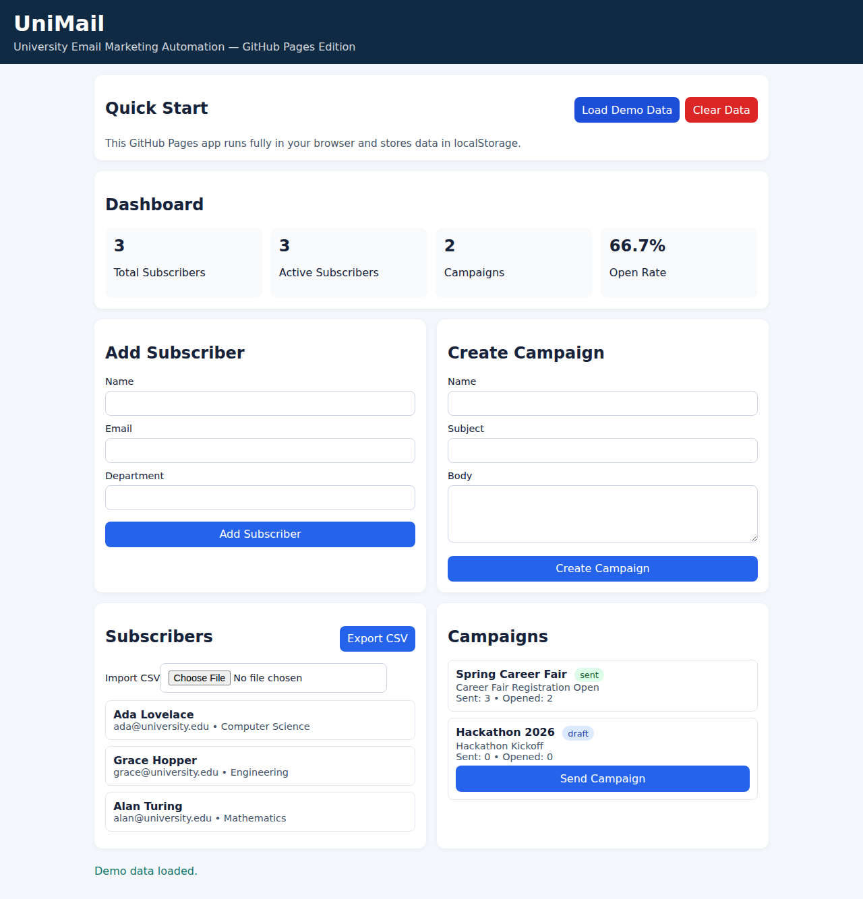
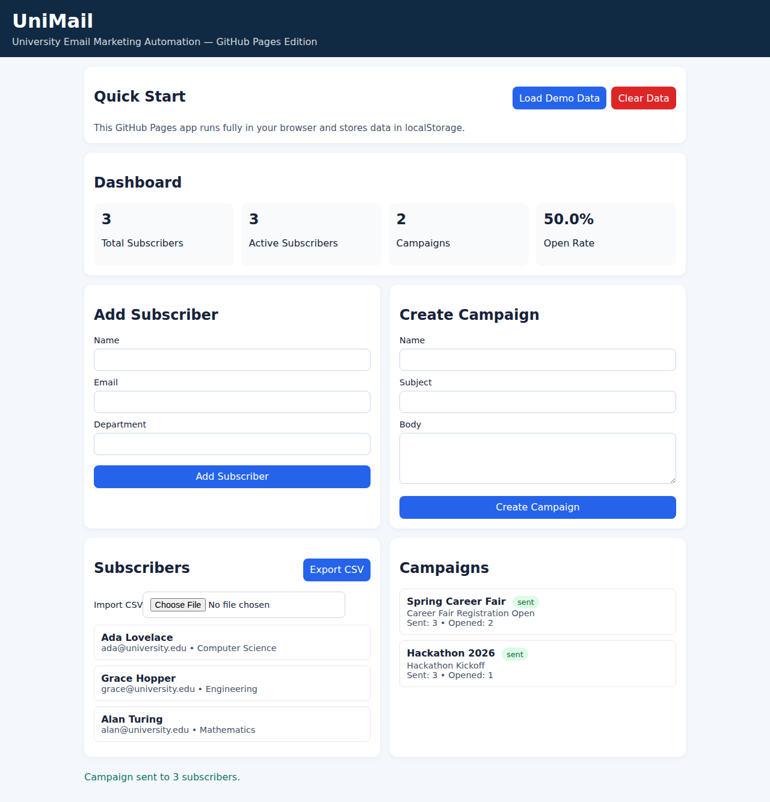
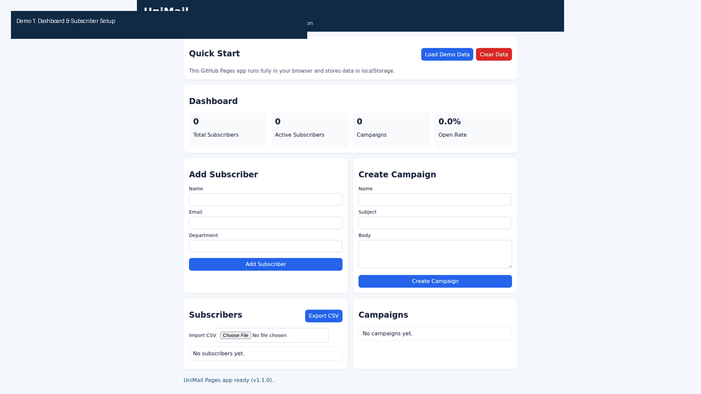
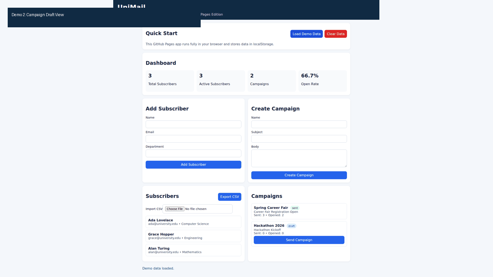

# UniMail — University Mail Automation

A production-ready university email marketing project with:
- **Flask backend app** for subscriber + campaign workflows
- **Static GitHub Pages web app** for instant browser-based demos


---

## Live Deployment

- **Expected GitHub Pages URL:** `https://DARREN-2000.github.io/University-Mail-Automation/`
- **Deploy workflow file:** `.github/workflows/deploy-pages.yml`
- **Trigger:** push to `main` or manual workflow dispatch

> If the URL is not loading yet, ensure:
> 1. This branch is merged to `main`
> 2. Repository **Settings → Pages → Source** is set to **GitHub Actions**
> 3. Latest **Deploy GitHub Pages** workflow run on `main` is successful

---

## Features

### Core Flask App
- Subscriber management (add/import/export, activate/deactivate)
- Tag-based segmentation
- Campaign creation and sending
- Open tracking
- REST APIs (`/api/stats`, `/api/subscribers`, `/api/campaigns`)
- Automated welcome email support

### GitHub Pages Web App (`docs/`)
- Dashboard metrics
- Subscriber create/list
- CSV import/export
- Campaign create/send simulation
- Local browser persistence (`localStorage`)
- Quick demo actions (load sample data / clear data)

---

## Screenshots

### 1) Fresh dashboard state


### 2) Demo data loaded


### 3) Campaign sent and KPI updated


---

## Short Demo Clips

### Demo 1 — Dashboard + data bootstrapping


### Demo 2 — Campaign send flow


---

## Quick Start (Flask App)

### Prerequisites
- Python 3.10+

### Installation
```bash
git clone https://github.com/DARREN-2000/University-Mail-Automation.git
cd University-Mail-Automation
python -m venv venv
source venv/bin/activate  # Windows: venv\Scripts\activate
pip install -r requirements.txt
```

### Configuration (optional `.env`)
```env
SECRET_KEY=your-secret-key
MAIL_SERVER=smtp.gmail.com
MAIL_PORT=587
MAIL_USE_TLS=true
MAIL_USERNAME=your-email@gmail.com
MAIL_PASSWORD=your-app-password
MAIL_DEFAULT_SENDER=your-email@gmail.com
```

### Run
```bash
python app.py
```

Open: `http://localhost:5000`

---

## Quick Start (GitHub Pages App)

Run locally:
```bash
cd docs
python -m http.server 4173
```

Open: `http://127.0.0.1:4173/index.html`

---

## Testing

```bash
python -m pytest tests/ -v
```

Current suite status in this branch: **31 passed**.

---

## Production-Readiness Notes

Implemented hardening for the static app:
- safer CSV parsing (handles quoted fields)
- explicit required-field validation
- local data management actions (seed/clear)
- robust localStorage save error handling
- improved accessibility semantics for status messages

For backend production use, recommended next steps:
- move from SQLite to managed Postgres
- deploy Flask behind Gunicorn + reverse proxy
- add secrets management (GitHub/Cloud secret store)
- add structured app logging + monitoring

---

## Deployment Workflow (GitHub Pages)

`deploy-pages.yml` publishes `docs/` as the Pages artifact.

```yaml
on:
  push:
    branches: ["main"]
  workflow_dispatch:
```

Deployment steps:
1. Checkout
2. Configure Pages
3. Upload `docs/`
4. Deploy to Pages

---

## Project Structure

```text
.
├── app.py
├── models.py
├── email_service.py
├── config.py
├── requirements.txt
├── templates/
├── static/
├── tests/
├── docs/
│   ├── index.html
│   ├── style.css
│   ├── app.js
│   └── assets/
│       ├── screenshots/
│       └── videos/
└── .github/workflows/
    └── deploy-pages.yml
```

---

## API Endpoints

- `GET /api/stats`
- `GET /api/subscribers`
- `GET /api/campaigns`

---

## License

Add a license file (`LICENSE`) to define usage terms.
